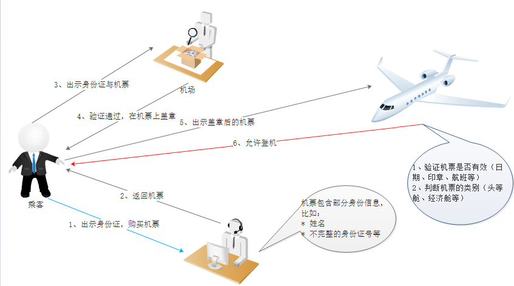

> 建议：
>
> - 使用（最新版的）intellij idea查看项目源码
> - 使用（Typora）查看文档（否则，图片/公式等，都可能显示不正常）

# 1 简介

模拟keycloak的功能。

## 1.1 核心

权限管理的核心，就两块：认证、授权

| 类别 | 描述     | 专用名词       |
| ---- | -------- | -------------- |
| 认证 | 你是谁   | authentication |
| 授权 | 能做什么 | authorization  |

**思考：观察下图，区分“认证”与“授权”**

## 1.2 OAuth2.0

# 2 版本管理

| 版本号 | 状态 | 功能列表                                                     |
| ------ | ---- | ------------------------------------------------------------ |
| 基本认证 | √    | 实现最基本的登录功能（不使用数据库，直接在代码里写死client/user/role等数据）  通过token，获取用户的Authentication  添加日志/swagger等辅助功能 |
| 摘要认证 | ×    | 实现digest authentication                                    |
| 扩展登录字段 |   √   |   按自己的需要加载用户的数据（不局限于loadUserByUsername）                                                           |
|拆分微服务（multiple-project）| √ | 拆分项目：公共的服务/认证服务端/认证客户端                   |
|RBAC模型| √ | 介绍RBAC的相关理念。另外，设定一个比较灵活的预设目标 |
|基于角色的验证| √ | 参考很常见的示例，使用hasRole/hasAuthority设置权限 |
|基于语义的验证| √ | 抽取一个实战的场景，用代码模拟验证的流程。且，从前端到后端，包括代码，跟权限相关的部分都是可配置的 |
|本地缓存token| √ | spring security oauth2，token集中存储在auth-server对应的缓存服务器上，当在线用户量很大时，光是交互token与authentication的数据，就会让redis占用全部的带宽。所以，使用本地缓存，缓解redis的压力 |
||  |                                                              |

