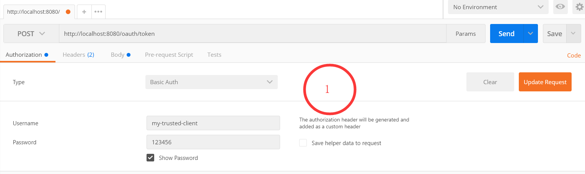
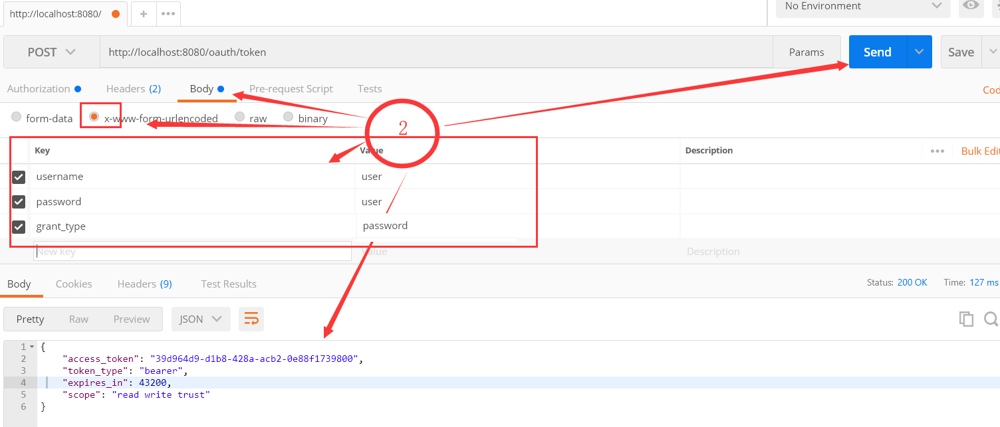
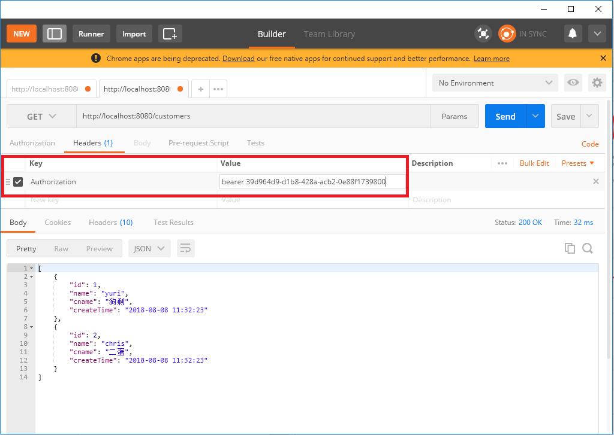
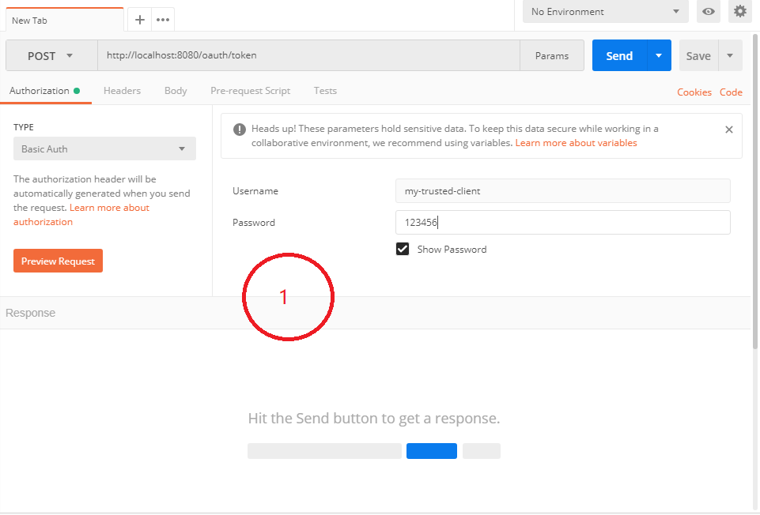
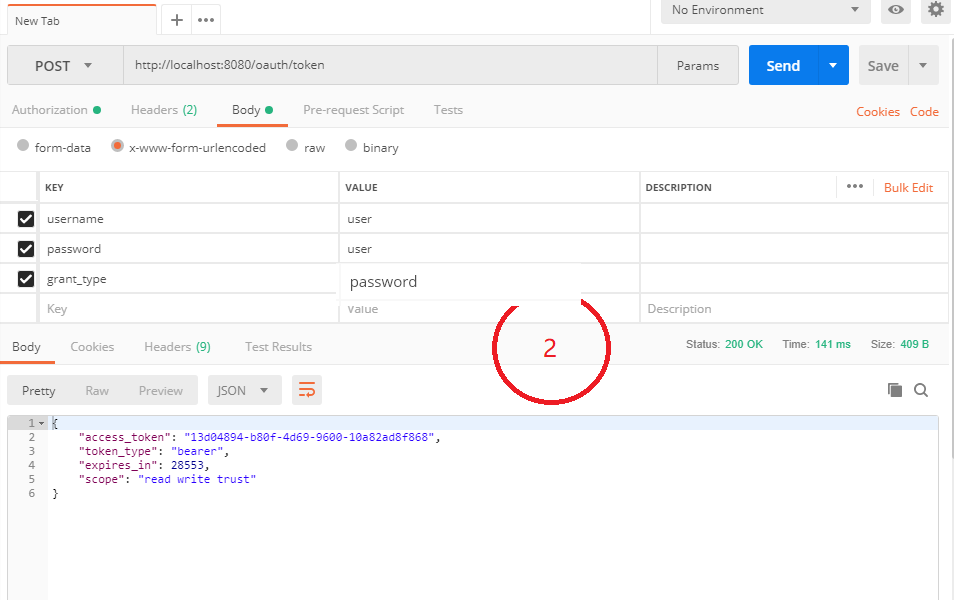
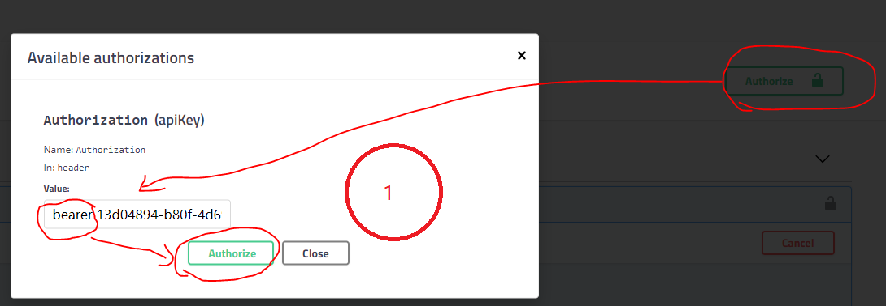
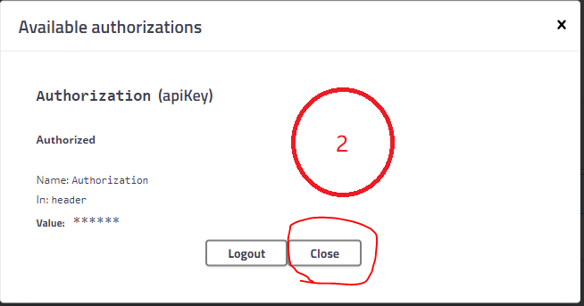
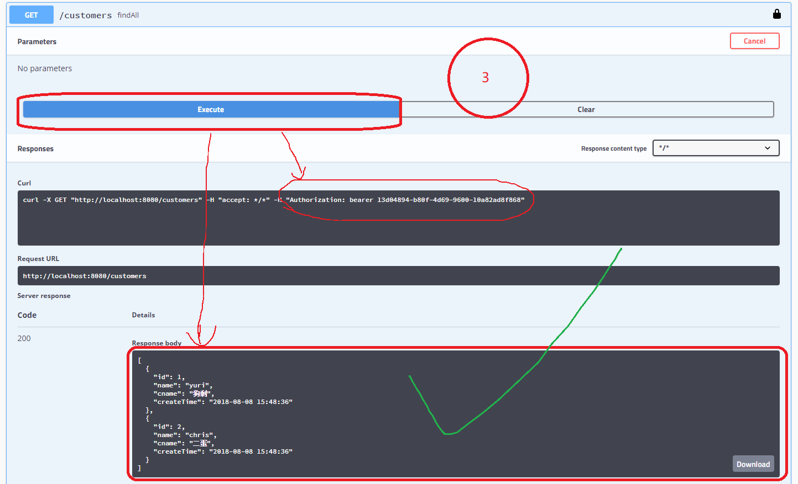

# 1 目的

实现基本的登录功能：

- 不需要token就能访问的功能
  - swagger（相当于帮助文档）
  - 登录接口（如果关闭这个接口，相当于修了一所没有门的房子）
    - 写死用户名&密码
- 需要token才能访问的接口
  - "/customers" (测试用的接口，显示`List<Customer>`)
  - oauth2相关的接口


# 2 配置

## 2.1 build.gradle.kts

```
import org.jetbrains.kotlin.gradle.tasks.KotlinCompile

plugins {
    val kotlinV = "1.2.60"
    val springbootV = "2.0.3.RELEASE"
    val springDepV = "1.0.6.RELEASE"
    id("org.springframework.boot") version springbootV
    id("org.jetbrains.kotlin.jvm") version kotlinV
    id("org.jetbrains.kotlin.plugin.spring") version kotlinV
    id("io.spring.dependency-management") version springDepV
    `idea`
    id("org.jetbrains.kotlin.plugin.allopen") version kotlinV
}

group = "org.authx"
version = "1.0-SNAPSHOT"

idea {
    module {
        setDownloadJavadoc(false)
        setDownloadSources(true)
    }
}

repositories {
    mavenCentral()
}

task<Wrapper>("local-wrapper") {
    //修改gradle的版本
    gradleVersion = "4.9"
}

val swaggerV = "2.9.2"
val spekV = "1.1.5"
val oauth2V = "2.3.3.RELEASE"
dependencies {
    compile("org.springframework.boot:spring-boot-starter-web") {
        exclude(module = "spring-boot-starter-tomcat")
    }
    compile("org.springframework.boot:spring-boot-starter-undertow")
    compile("org.springframework.security.oauth:spring-security-oauth2:$oauth2V")
    compile(kotlin("stdlib-jdk8"))
    compile(kotlin("reflect"))
    compile("com.fasterxml.jackson.module:jackson-module-kotlin")
    compile(kotlin("test"))
    compile("io.springfox:springfox-swagger2:$swaggerV")
    compile("io.springfox:springfox-swagger-ui:$swaggerV")
    testCompile("org.jetbrains.spek:spek-api:$spekV")
    testRuntime("org.jetbrains.spek:spek-junit-platform-engine:$spekV")
    testCompile("org.springframework.boot:spring-boot-starter-test") {
        exclude(module = "junit")
    }
    testImplementation("org.junit.jupiter:junit-jupiter-api")
    testRuntimeOnly("org.junit.jupiter:junit-jupiter-engine")
}

tasks.withType<KotlinCompile> {
    kotlinOptions {
        jvmTarget = "1.8"
        freeCompilerArgs = listOf("-Xjsr305=strict")
    }
}
tasks.withType<Test> {
    useJUnitPlatform()
}
```

## 2.2 SpringBootApplication

```
package org.authx

import org.springframework.boot.autoconfigure.SpringBootApplication
import org.springframework.context.annotation.Bean
import org.springframework.security.crypto.bcrypt.BCryptPasswordEncoder
import org.springframework.security.crypto.password.PasswordEncoder


@SpringBootApplication
class Config{
    @Bean
    fun passwordEncoder(): PasswordEncoder = BCryptPasswordEncoder()
}
```

## 2.3 写死username和password

```
package org.authx.config

import org.springframework.beans.factory.annotation.Autowired
import org.springframework.context.annotation.Configuration
import org.springframework.security.config.annotation.authentication.builders.AuthenticationManagerBuilder
import org.springframework.security.crypto.password.PasswordEncoder

@Configuration
class AuthenticationConfig(val passwordEncoder: PasswordEncoder) {
    @Autowired
    fun configureGlobal(auth: AuthenticationManagerBuilder): Unit {
        auth.inMemoryAuthentication()
                .passwordEncoder(passwordEncoder)
                .withUser("user").password("user")
                .authorities("ROLE_USER")
    }
}
```

## 2.4 配置oauth-server

```
package org.authx.config

import org.springframework.context.annotation.Configuration
import org.springframework.security.crypto.password.PasswordEncoder
import org.springframework.security.oauth2.config.annotation.configurers.ClientDetailsServiceConfigurer
import org.springframework.security.oauth2.config.annotation.web.configuration.AuthorizationServerConfigurerAdapter
import org.springframework.security.oauth2.config.annotation.web.configuration.EnableAuthorizationServer
import org.springframework.security.oauth2.config.annotation.web.configurers.AuthorizationServerSecurityConfigurer

@Configuration
@EnableAuthorizationServer
class OAuth2Config(val passwordEncoder: PasswordEncoder) : AuthorizationServerConfigurerAdapter() {
    override fun configure(security: AuthorizationServerSecurityConfigurer) {
        security
                .tokenKeyAccess("permitAll()") //所有的接口都需要校验token
                .checkTokenAccess("isAuthenticated()") //判断是否已认证
                .allowFormAuthenticationForClients() //允许client通过form传参
    }

    override fun configure(clients: ClientDetailsServiceConfigurer) {
        clients.inMemory()
                .withClient("my-trusted-client")
                .authorizedGrantTypes("client_credentials", "password", "refresh_token")
                .authorities("ROLE_TRUSTED_CLIENT")
                .scopes("read", "write", "trust")
//                .resourceIds("oauth2-resource")
                .secret(passwordEncoder.encode("123456"))
        /*.accessTokenValiditySeconds(60 * 60 * 12) //默认12小时。设置为0，表示“永不过期”
        .refreshTokenValiditySeconds(60 * 60 * 24 * 30) //默认30天 */
    }
}
```

## 2.5 配置oauth-server的资源

```
package org.authx.config

import org.springframework.context.annotation.Configuration
import org.springframework.security.config.annotation.web.builders.HttpSecurity
import org.springframework.security.config.http.SessionCreationPolicy
import org.springframework.security.oauth2.config.annotation.web.configuration.EnableResourceServer
import org.springframework.security.oauth2.config.annotation.web.configuration.ResourceServerConfigurerAdapter

@Configuration
@EnableResourceServer
class ResourceConfig : ResourceServerConfigurerAdapter() {
    override fun configure(http: HttpSecurity) {
        http.authorizeRequests()
                .antMatchers(
                        //swagger2
                        "/swagger-ui.html/**",
                        "/webjars/springfox-swagger-ui/**",
                        "/swagger-resources/**",
                        "/v2/api-docs",

                        //oauth2
                        "/health",
                        "/oauth/authorize", // 授权端点
                        "/oauth/token", // 令牌端点
                        "/oauth/confirm_access", // 用户确认授权提交端点
                        "/oauth/error", // 授权服务错误信息端点
                        "/oauth/check_token", // 用于资源服务访问的令牌解析端点
                        "/oauth/token_key" // 提供公有密匙的端点，如果你使用JWT令牌的话
                ).permitAll() // 上面设置的url，允许不登录，就可以访问
                .anyRequest().authenticated() //其他url，都必须授权成功后，才允许访问
                .and()
                .sessionManagement().sessionCreationPolicy(SessionCreationPolicy.STATELESS) //关闭session
                .and()
                .formLogin().disable()
                .cors().disable() //关闭CORS
                .csrf().disable() //关闭CSRF
                .httpBasic().disable() // 关闭httpBasic
    }
}
```

# 3 测试

> 工具：postman

## 3.1 登录





## 3.2 访问接口"/customers"




# 4 改进

## 4.1 需求

- 被OAuth保护的资源，必须有token才能访问
- swagger2需要一套独立的配置，才能在swagger-ui中看到填写“token”的文本框
- swagger2可以对API分组。建议，分为3组：
  - OAuth自带的API
  - public API（瞎起的名字。自定义的API，不需要token，就可以访问）
  - private API（同样是瞎起的名字。自定义的API，且，必须有token才可以访问）

## 4.2 相关代码

```
package org.authx.config

import org.springframework.context.annotation.Bean
import org.springframework.context.annotation.Configuration
import springfox.documentation.builders.PathSelectors
import springfox.documentation.builders.RequestHandlerSelectors
import springfox.documentation.service.ApiKey
import springfox.documentation.service.SecurityReference
import springfox.documentation.spi.DocumentationType
import springfox.documentation.spi.service.contexts.SecurityContext
import springfox.documentation.spring.web.plugins.Docket
import springfox.documentation.swagger2.annotations.EnableSwagger2


@EnableSwagger2
@Configuration
class Swagger2Config {

    @Bean
    fun restApi(): Docket = Docket(DocumentationType.SWAGGER_2)
            .groupName("default-rest-api")
            .select()
            .apis(RequestHandlerSelectors.basePackage("org.authx.controller"))
            .build()
            .securitySchemes(listOf(ApiKey("Authorization", "Authorization", "header")))
            .securityContexts(listOf(
                    SecurityContext(
                            listOf(SecurityReference("Authorization", arrayOf())),
                            PathSelectors.regex("/customers.*")
                    )
            ))

    /**
     *  swagger2 API，去掉默认的error接口
     */
    @Bean
    fun oauthApi(): Docket = Docket(DocumentationType.SWAGGER_2)
            .groupName("oauth")
            .select()
            .apis(RequestHandlerSelectors.any())
            .paths(PathSelectors.regex("/oauth.*"))
            .build()

}
```

## 4.3 测试

### 4.3.1 postman

同上

### 4.3.2 `swagger-ui`

#### 4.3.2.1 获取token

注：获取token的接口，参数是Map。`swagger-ui`虽然可以正确显示接口的内容，但，无法使用。所以，只能先通过postman获取token





#### 4.3.2.2 Authorize

每个受保护的接口，都需要token。所以，swagger2，通过Authorize操作，可以保存token。

之后，访问接口的时候，会自动带上token。








# 5 相关知识点

## 5.1 postman

[参考文档](http://www.cnblogs.com/mafly/p/postman.html)

- 安装chrome浏览器
- [下载postman](https://www.getpostman.com/apps)
- 注册（也可以使用google的账号直接登录）

## 5.2 swagger2 API group

### 5.2.1 group name

swagger默认打开的group，是按英文字母排序的。所以，起名字的时候，得注意了

### 5.2.2 Authorize的方式

swagger支持？中Authorize的方式。


## 5.3 logstash

[参考文档](https://cloud.spring.io/spring-cloud-sleuth/single/spring-cloud-sleuth.html)

官网的介绍：Logstash 是开源的服务器端数据处理管道，能够同时 从多个来源采集数据、转换数据，然后将数据发送到您最喜欢的 “存储库” 中。 

先使用部分功能，将日志格式向logstash靠拢

- 格式标准些。如果自己定义格式，也是到处抄
- 先让眼睛适应一段时间。后期，如果有问题，可以在短时间内找到重点
- 扩展性好，spring cloud + docker的环境，也可以继续使用。不需要改一行代码，就能拥有工业级的日志能力

### 5.3.1 输出到控制台 Or 文件？

>  在代码里加日志，就不罗嗦了。debug/warn/info/trace等级别，也不是重点。

使用docker后，日志的数据，也由容器管理。于是，我们只需要把日志打印到控制台，之后的问题，都交给容器了。

> 或许，公司的生产服务器没有用docker，坦白说，技术有点落后了。

### 5.3.2 日志打印的时间

容器会给每条信息都加上时间。所以，输出的日志，需要区分本地代码和容器中的代码。

总之，

- 容器中的日志，不需要打印时间
- 本地的代码，如果不在容器里跑的话，还是要打印时间的

### 5.3.3 json

容器中的日志，还需要使用json的格式，当然，这也是logstash推荐的。

### 5.3.4 demo

```
<configuration>
  <include resource="org/springframework/boot/logging/logback/defaults.xml"/>

  <springProperty scope="context" name="springAppName" source="spring.application.name"/>

  <!-- You can override this to have a custom pattern -->
  <property name="CONSOLE_LOG_PATTERN"
    value="%clr(%d{yyyy-MM-dd HH:mm:ss.SSS}){faint} %clr(${LOG_LEVEL_PATTERN:-%5p}) %clr(${PID:- }){magenta} %clr(---){faint} %clr([%15.15t]){faint} %clr(%-40.40logger{39}){cyan} %clr(:){faint} %m%n${LOG_EXCEPTION_CONVERSION_WORD:-%wEx}"/>

  <!-- Appender to log to console -->
  <appender name="console" class="ch.qos.logback.core.ConsoleAppender">
    <filter class="ch.qos.logback.classic.filter.ThresholdFilter">
      <!-- Minimum logging level to be presented in the console logs-->
      <level>DEBUG</level>
    </filter>
    <encoder>
      <pattern>${CONSOLE_LOG_PATTERN}</pattern>
      <charset>utf8</charset>
    </encoder>
  </appender>

  <appender name="logstash" class="ch.qos.logback.core.ConsoleAppender">
    <encoder class="net.logstash.logback.encoder.LoggingEventCompositeJsonEncoder">
      <providers>
        <pattern>
          <pattern>
            {
            "severity": "%level",
            "service": "${springAppName:-}",
            "trace": "%X{X-B3-TraceId:-}",
            "span": "%X{X-B3-SpanId:-}",
            "parent": "%X{X-B3-ParentSpanId:-}",
            "exportable": "%X{X-Span-Export:-}",
            "pid": "${PID:-}",
            "thread": "%thread",
            "class": "%logger{40}",
            "rest": "%message"
            }
          </pattern>
        </pattern>
      </providers>
    </encoder>
  </appender>

  <root level="info">
    <appender-ref ref="console"/>
    <!--<appender-ref ref="logstash"/>-->
  </root>
</configuration>
```


# 6 修复BUG

## 6.1 “Unsupported grant type: password”

### 6.1.2 BUG描述

- 如果不配置bean `AuthenticationManager`，就不支持password的grant_type
- 新版本的spring-security-oauth2，如果使用BCryptPasswordEncoder，那么，在配置的时候，就要对密码加密。即`encoder.encode("password")`

### 6.1.3 修复过程

- 修改错误的图片（还是之前的流程，修正文档中的图片）

  或许，markdown不能展示图片的修改过程，但，重新复盘所有的代码，同样会遇到BUG。

  总之，grant_type应该是password（修改之前，只能使用client_credentials）

- 配置bean`AuthenticationManager`

- 加密user的password

> 详情，见源码

